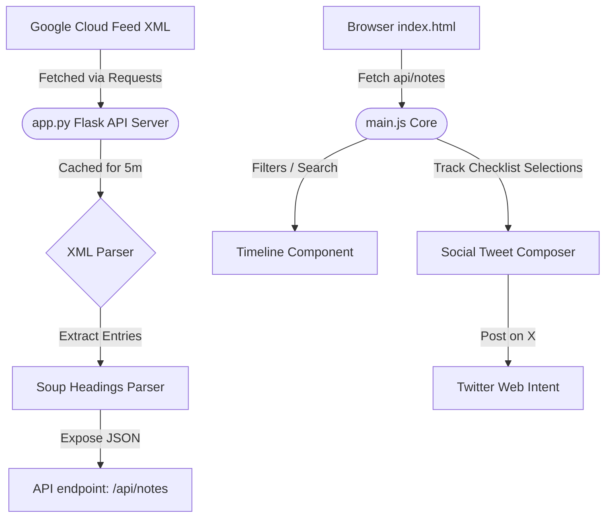

# BigQuery Release Notes Hub & Social Composer

A Flask-based web application with a dashboard to browse Google Cloud BigQuery release notes, filter by update type, search key terms, and compose and share customized updates to X (Twitter).

## Architecture & File Directory

The application structure is organized as follows:
* app.py: The core Python Flask server. It handles fetching Google's live XML feed, parsing HTML elements via BeautifulSoup, caching feed content to prevent query limits, and exposing a structured JSON API.
* templates/index.html: The responsive, semantic dashboard UI. Includes filters for update types, a live character metrics count, and X (Twitter) integration tags.
* static/css/style.css: Vanilla CSS styling implementation. Uses a premium dark-mode theme, glassmorphic container cards, glowing state colors, and shimmer animation loading effects.
* static/js/main.js: Frontend orchestrator. Manages checklist state selections, search term matching, skeleton layout switches, and dynamic character count circles.
* requirements.txt: Environment dependencies configuration.



## Key Features

1. **Structured Headings Parser**: Atom release notes are split into distinct, readable micro-cards grouped by heading categories (`Feature`, `Announcement`, `Issue`, `Deprecation`, `General`) rather than a single monolithic daily list.
2. **Search and Quick Filter Navigation**: Users can instantly filter notes by category or search terms globally while retaining date structures.
3. **Multi-Select Tweet Drafting**: Multiple checked notes are compiled into a single formatted draft tweet. If it exceeds 280 characters, it is truncated dynamically.
4. **Direct Share Action**: Each card includes an instant "Share" button to post a quick summary of a single item directly to X.
5. **Caching & Force Refresh**: Caches responses for 5 minutes. The **Refresh** button triggers an immediate reload, bypassing cache and displaying a rotating loader state.

## How to Start the App

1. Ensure the virtual environment is activated:
   ```bash
   source venv/bin/activate
   ```
2. Run the application:
   ```bash
   python3 app.py
   ```
3. Open your browser and navigate to:
   [http://127.0.0.1:5050/](http://127.0.0.1:5050/)
