# BigQuery Release Notes Hub: Technical Deep Dive

This document details the architectural design, code logic, and end-to-end execution flows of the **BigQuery Release Notes Hub** web application.

---

## 🌟 Main Features Breakdown

1. **Granular HTML Sectioning**: Google’s release notes are combined chronologically in a feed. Our parser extracts individual updates (Features, Announcements, Issues, Deprecations) from each daily entry, turning monolithic lists into queryable individual components.
2. **Double-Trigger Social Workflows**:
   * **Individual Card Sharing**: Encodes a single note with dedicated category emojis, date tags, and a link to the specific section.
   * **Multi-Select Draft Consolidation**: Builds unified tweets dynamically from check-boxed items, handling 280-character counts, character progress bars, and trailing hashtags.
3. **Optimized Caching Loop**: Limits connections to Google Cloud Servers by implementing a 5-minute cache with a manual force-refresh escape hatch.
4. **Interactive Dashboard Visuals**: A dark-mode layout with responsive flex/grid displays, animated hover effects, interactive character meters, and skeleton loading screens.

---

## ⚙️ Server-Side Architecture (`app.py`)

The backend is built using **Python Flask** and acts as an API proxy. It fetchs, parses, and structures Google's XML feed.

### Core Modules Used:
* `xml.etree.ElementTree (ET)`: Handles core XML namespaces and tree parsing.
* `BeautifulSoup (bs4)`: Extracted to traverse unstructured HTML in the feed's content body.
* `requests`: Manages HTTP client connections with timeouts.
* `hashlib`: Generates stable hashes from note text for DOM tracking IDs.

### Core Logic Flows:

#### 1. Namespace Handling
Google Cloud feeds utilize the Atom namespace (`http://www.w3.org/2005/Atom`). We navigate this using custom XML selectors:
```python
ns = {'atom': 'http://www.w3.org/2005/Atom'}
```

#### 2. Parsing Algorithm (Heading-Grouping)
Because each daily entry's XML body contains general HTML, we parse the body with `BeautifulSoup` and iterate through its root-level siblings to split items by headers:
```python
current_category = "General"
current_elements = []

for child in soup.contents:
    if child.name in ['h1', 'h2', 'h3', 'h4', 'h5', 'h6']:
        if current_elements:
            add_update(current_category, current_elements)
        current_category = child.get_text(strip=True)
        current_elements = []
    elif child.name or (isinstance(child, str) and child.strip()):
        current_elements.append(child)
```
This guarantees that sub-elements (like paragraphs or bullet points) are correctly grouped under their respective headers.

#### 3. API Endpoints
* `GET /`: Serves the base template (templates/index.html).
* `GET /api/notes`: Returns parsed release notes as JSON. Accepts `refresh=true` to force a network fetch instead of serving from the cache.

---

## 🖥️ Client-Side Architecture (`static/js/main.js` & `static/css/style.css`)

The frontend is an interactive Single Page Application (SPA) utilizing vanilla web APIs.

### Core Components:

#### 1. DOM Manager & Event Loop (`main.js`)
* **Checked Notes Tracker**: Uses a JS `Map` object to store selected updates (`cardId -> {date, category, text}`). This maintains insertion order and guarantees fast lookup speeds.
* **Character Metric Watcher**: Drives a circular progress ring. Updates `stroke-dashoffset` dynamically using the SVG circumference formula ($2 \pi r \approx 69.1$) and alters color classes (warning vs error) depending on text limits.

#### 2. Visual Layer (`style.css`)
* **Theme Tokens**: Leverages CSS Custom Properties to declare unified theme colors (deep space slate backgrounds, neon category indicators, glassmorphic card variables).
* **Skeleton Loading**: Creates a shimmering state using CSS keyframes that shifts a linear gradient across placeholders during active loads.

---

## 🔄 Request-Response Sequence Flow

Here is a step-by-step trace of what happens when a user clicks the **Refresh** button on the client dashboard:

```mermaid
sequenceDiagram
    autonumber
    actor User as User
    participant JS as main.js (Client)
    participant Flask as app.py (Server)
    participant Cache as Cache State (Memory)
    participant Google as GCP Release Notes Feed

    User->>JS: Click "Refresh" Button
    JS->>JS: Disable Refresh button & Add spin animation
    JS->>JS: Display Shimmer Skeleton Screens
    JS->>Flask: HTTP GET /api/notes?refresh=true
    
    rect rgb(30, 41, 59)
        note right of Flask: Bypass cache check since refresh=true
        Flask->>Google: HTTP GET bigquery-release-notes.xml
        Google-->>Flask: HTTP 200 (XML Atom Feed Payload)
        Flask->>Flask: Parse XML Tree (ET)
        Flask->>Flask: Parse & section HTML content (BeautifulSoup)
        Flask->>Flask: Hash categories and compile JSON list
        Flask->>Cache: Save compiled JSON and update timestamp
    end
    
    Flask-->>JS: HTTP 200 (JSON Release Notes Array)
    JS->>JS: Remove skeleton screen & Render card timeline
    JS->>JS: Match checkboxes to current selectedNotes Map
    JS->>JS: Update Cache status text and stop spin animation
    JS-->>User: Visual Update Done (Show Toast Notification)
```



### Trace Details:
1. **User Action**: Clicking `Refresh` triggers the click listener in main.js.
2. **Interactive Handlers**: The UI responds immediately. The refresh button is disabled, the SVG spin animation is added, and the feed container is replaced with the `.skeleton-timeline`.
3. **Endpoint Requests**: An AJAX fetch is made to `/api/notes?refresh=true`. The `refresh=true` query parameter tells the backend to fetch new data instead of returning cached memory.
4. **Feed Acquisition**: The backend fetches the official XML file.
5. **Feed Processing**: 
   * It parses the entries.
   * `BeautifulSoup` splits the body of each entry using headings as segment boundaries.
   * It creates objects containing the date, category, HTML body, plaintext content, and a unique ID.
6. **API Response**: The backend returns the list as JSON and caches it.
7. **DOM Construction**: The frontend client receives the JSON, compiles the HTML structure dynamically, updates checkboxes to preserve active selection maps, resets the filter controls, and triggers a toast notification indicating completion.
